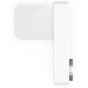

# Luxafor Webpack Plugin

**Copyright © 2017** by [Daan Kets](https://www.linkedin.com/in/daankets) of [Delta Source](https://www.deltasource.eu)

## About

I wrote this plugin in order to be able to monitor my background **webpack watch & build process**. It connects to a [Luxafor USB LED flag](https://luxafor.com/luxafor-flag/), and will light the flag during the build using different **colors** to indicate the build **progress** & **status**.

## Luxafor?

The [Luxafor USB LED flag](https://luxafor.com/luxafor-flag/) is a **USB connected RGB led** in flag design, with a magnet to attach it to your screen (or whereever). Although it was originally intended to indicate your busy/available status, I prefer using it for monitoring my webpack build status. So I know when to refresh my browser (when not using livereload). Or, in case of long build, I know when to *finish my cofee*, and return to my laptop ;-)



## Installation & use

Install per project using npm:

`npm install —save-dev luxafor-webpack`

Then, add it to the plugins section of your webpack configuration file, preferably as one of the first plugins:

### Example (ES 6) - gulpfile.babel.js

```javascript 1.5
import LuxaforWebpackPlugin from "@deltasource/luxafor-webpack";

const myOptions = {
  timeout: 0
};

export default {
	// ... Rules and other webpack stuff
	plugins: [
  		new LuxaforWebpackPlugin(myOptions) // The plugin is enabled!
	]  
}
```

### Example (JS 1.5) - gulpfile.js
```javascript 1.5
// Requires you to refer to 'default' due to the CommonJS packaging.
const LuxaforWebpackPlugin = require("@deltasource/luxafor-webpack").default;

const myOptions = {
  timeout: 0
};

export default {
	// ... Rules and other webpack stuff
	plugins: [
  		new LuxaforWebpackPlugin(myOptions) // The plugin is enabled!
	]  
}
```

The plugin will automatically detect and use the Luxafor USB device if present.

## Options (TypeScript format)

```typescript
import {IOptions, LuxaforWebpackPlugin} from "@deltasource/luxafor-webpack";

const defaultOptions = Object.freeze({
	colors: {
		warning: "#f4511e",
		compile: "#ffb300",
		optimize: "#1e88e5",
		error: "#e53935",
		success: "#43a047"
	},
	timeout: 5000 // <= 0 means no timeout!
} as IOptions);

// Note that the Javascript version works too. Just leave out the <...> type of the options.
```
As you can see above, it is possible to customize the Colors. Colors must be in css hexadecimal string format (case-insensitive). The following color values exist:

### Colors (and their default values)

* **compile**: string = <span style="color: #ffb300">"#ffb300"</span>
  This color is activated when a new compilaton phase is started.
* **optimize**: string = <span style="color: #1e88e5">"#1e88e5"</span>
  This color is activated when a new omtimization phase is started.
* **warning**: string = <span style="color: #f4511e">"#f4511e"</span>
  This color is set for [timeout] seconds when a build finishes with warnings.
* **error**: string = <span style="color: #e53935">"#e53935"</span>
  This color is set for [timeout] seconds when a build finishes with errors.
* **success**: string = <span style="color: #43a047">"#43a047"</span>
  This color is set for [timeout] seconds when a build finishes successfully.

> Default colors thanks to the Google Material Design color palette (hue 600).

### Timeout

The **timeout** defines how long the LED should stay on after the build completes. If set, the LED will poweroff after … milliseconds. Set this value to **0 or lower** in order to keep the LED on.

## Technology

This library was developed using TypeScript, transpiled to ES5, optimized for Node 6. Typescript was used for the added value of type safety. Versions previous to 1.2.0 also depended on the babel-runtime. This dependency was removed in order to have a leaner package.

# Copyright & License

The plugin is released under the BSD 2.0 license. If you include this library as a part of your own binaries, please respect the attribution clause.
